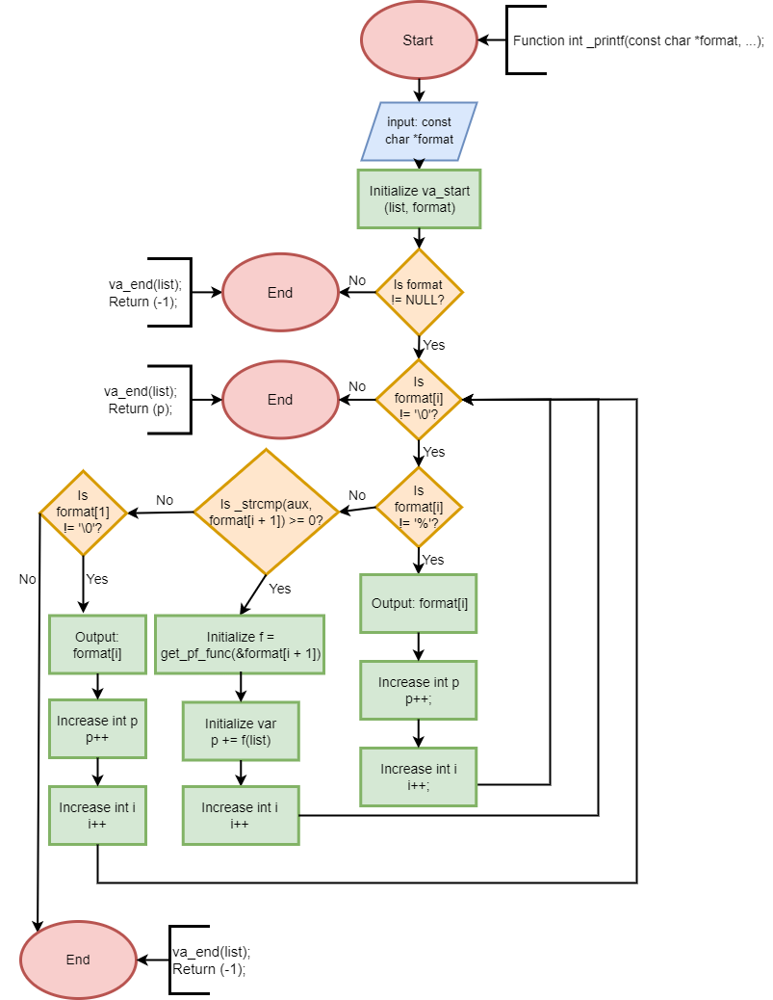

**_printf**
---
This program emulates a sizeable chunk of printf's functionality, outputting data introduced via input in an arguement variable of type pointer to a string. _printf essentially checks through every single character of any given string, and checks for any format specifiers. If said char is not one, it will output the char via a mixture of write and _putchar usage. Otherwise it will detect the format specifier type being used, which it will then act accordingly for, in the same way the actual printf function would. At the moment it can only account for the following format specifier types: `%c`, `%s`, `%d`, `%i` and `%%`.

Pictured below is a flowchart detailing the process the main _printf function goes through:
---

---

***This program was written by Mauricio de Betolaza del Puerto && IV-an Rodríguez Pointin.***
